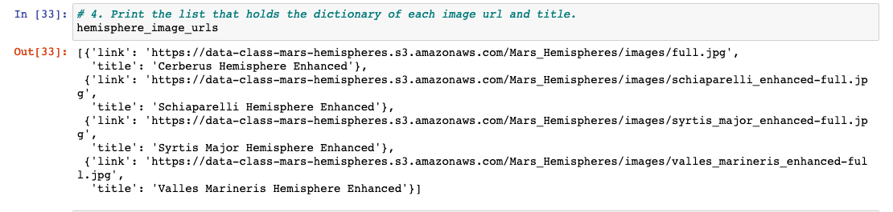
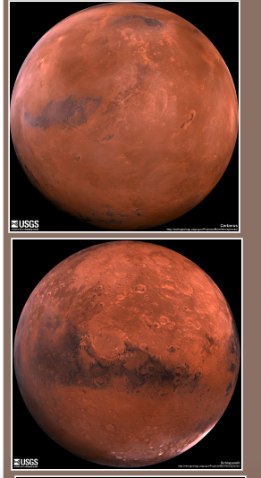
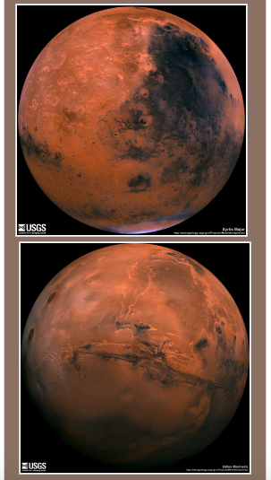
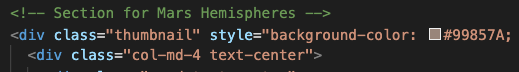
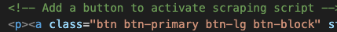
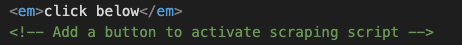

# Mission_to_Mars
module 10
Robin's web app is looking good and functioning well, but she wants to add more polish to it. She had been admiring images of Mars’s hemispheres online and realized that the site is scraping-friendly. She would like to adjust the current web app to include all four of the hemisphere images. To do this, you’ll use BeautifulSoup and Splinter to scrape full-resolution images of Mars’s hemispheres and the titles of those images, store the scraped data on a Mongo database, use a web application to display the data, and alter the design of the web app to accommodate these images.
What You're Creating

This new assignment consists of three technical analyses. You will submit the following deliverables:

   Deliverable 1: Scrape Full-Resolution Mars Hemisphere Images and Titles
    
   
    
    
   Deliverable 2: Update the Web App with Mars Hemisphere Images and Titles
    
   
   
    
   Deliverable 3: Add Bootstrap 3 Components
   
   *adding a background color
   
   
   *creating a large button
   
   
   *adding a "click below" label above the button
   

